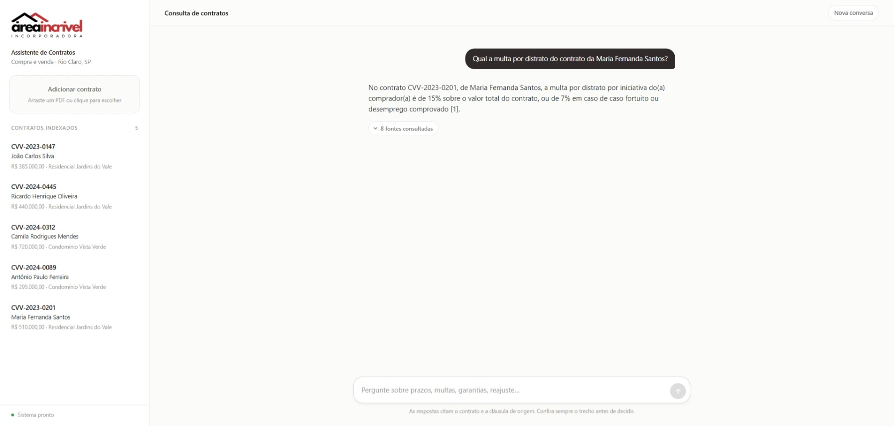

# Assistente de Contratos — Área Incrível

Sistema RAG para consulta em linguagem natural sobre contratos de compra e venda
de imóveis. Faz upload de PDFs, indexa por cláusula em um banco vetorial e
responde perguntas citando o trecho exato e o contrato de origem — ou diz
claramente que a informação não existe.



---

## Stack

| Camada | Tecnologia |
|--------|-----------|
| Backend | Node.js 22 · TypeScript · Fastify 5 |
| Banco | PostgreSQL 17 + pgvector |
| Embeddings | Transformers.js · `multilingual-e5-small` (local, sem API key) |
| LLM | Google Gemini (configurável por variável de ambiente) |
| Frontend | React 18 · TypeScript · Vite · nginx |
| Orquestração | Docker Compose |

---

## Como rodar

### O que você precisa

- **Docker** e **Docker Compose** (Docker Desktop no Windows/macOS)
- Uma **chave de API do Google Gemini** — gratuita em
  [aistudio.google.com/apikey](https://aistudio.google.com/apikey)
- Portas livres: **8080** (interface), **3333** (API), **5432** (banco)
- **Conexão com a internet no primeiro boot** — o modelo de embeddings
  (~120 MB) é baixado uma vez e fica em volume Docker

Não é necessário ter Node.js, Python ou Postgres instalados na máquina.

### Passo a passo

```bash
git clone https://github.com/mylenavitoriano/assistente-contratos-rag.git
cd assistente-contratos-rag
cp .env.example .env
```

Abra o `.env` e preencha a única variável obrigatória:

```
LLM_API_KEY=sua_chave_do_gemini_aqui
```

Suba tudo:

```bash
docker compose up
```

Abra **http://localhost:8080**.

No primeiro boot o backend baixa o modelo de embeddings — leva de 30 a 60
segundos. A interface mostra *"Carregando modelo de busca"* no rodapé da barra
lateral e libera o campo de perguntas sozinha quando fica pronto.

### Carregar os contratos de exemplo (opcional)

O sistema sobe vazio. Você pode arrastar PDFs pela interface ou popular os cinco
contratos de exemplo de uma vez:

```bash
node scripts/seed.mjs
```

### Trocar a chave ou o modelo do LLM

Edite o `.env` e reinicie com `docker compose up -d` — nenhum arquivo de código
é alterado:

```
LLM_API_KEY=outra_chave
LLM_MODEL=gemini-3.5-flash
```

---

## Como usar

1. **Adicione contratos** — arraste um PDF para a área na barra lateral. O
   sistema extrai o texto, divide por cláusula, gera os embeddings e mostra
   comprador, valor e empreendimento no card.
2. **Pergunte** — em linguagem natural, sobre um contrato específico ou sobre
   todos.
3. **Confira a fonte** — clique em *"N fontes consultadas"* abaixo de qualquer
   resposta para ver o trecho exato, a cláusula e a página de origem.
4. **Continue a conversa** — perguntas de acompanhamento mantêm o contexto
   ("e qual a garantia *dela*?").

---

## API

| Método | Rota | Descrição |
|--------|------|-----------|
| `GET` | `/api/health` | Estado do banco e do modelo de embeddings |
| `GET` | `/api/contracts` | Lista os contratos indexados |
| `POST` | `/api/contracts` | Upload de PDF (`multipart/form-data`, campo `file`) |
| `DELETE` | `/api/contracts/:id` | Remove o contrato e seus chunks |
| `GET` | `/api/search?q=&topK=` | Busca híbrida com os rankings expostos |
| `POST` | `/api/chat` | Resposta RAG em streaming (SSE) |
| `GET` | `/api/conversations/:id/messages` | Histórico da conversa |

O `/api/chat` emite eventos SSE na ordem `conversation` → `sources` → `delta`\*
→ `done`, ou `error`.
